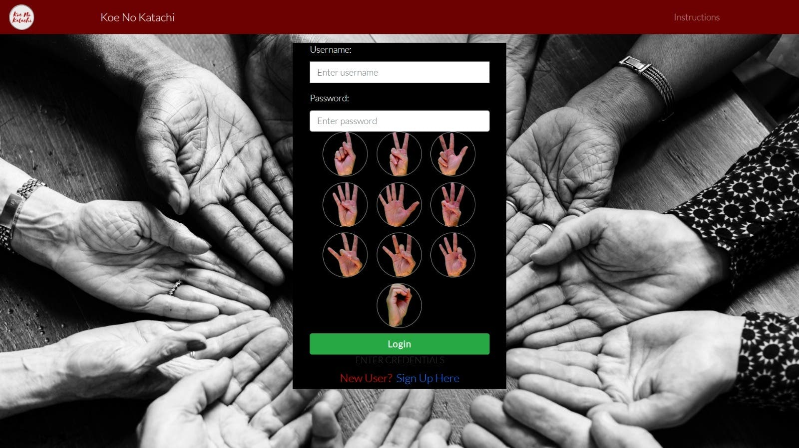
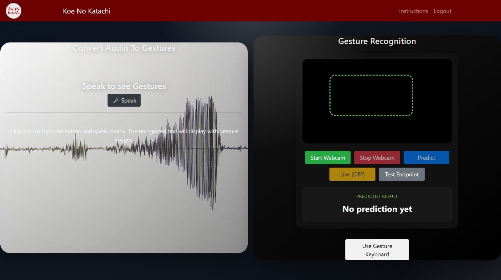
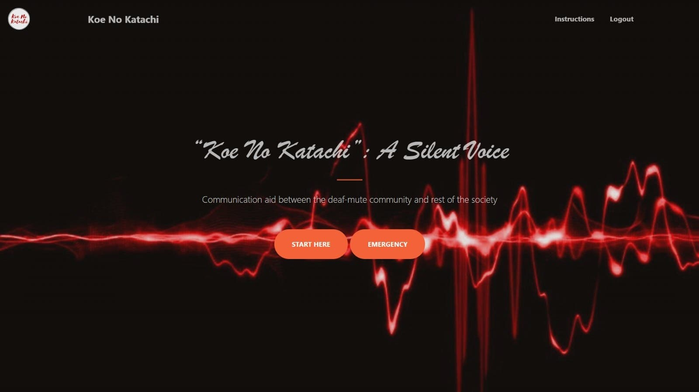
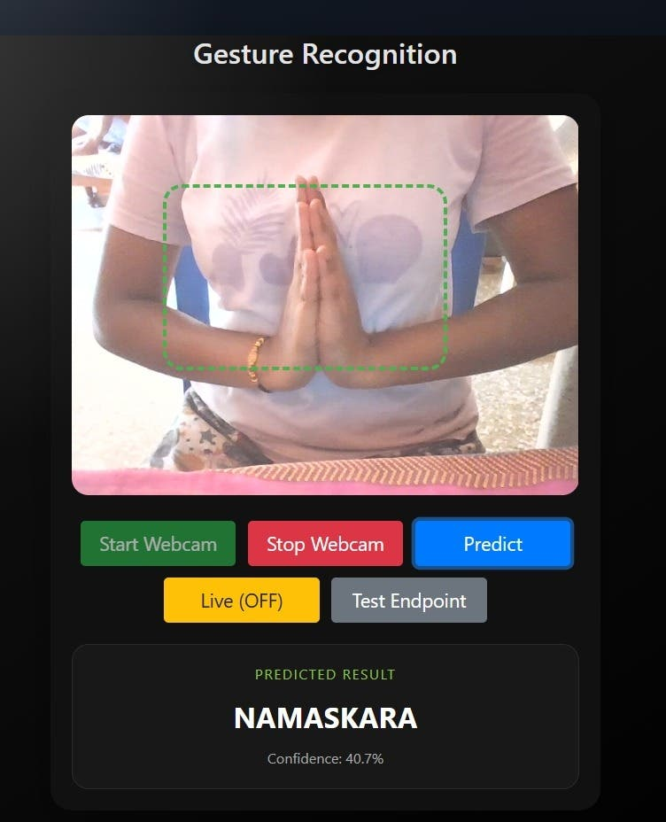
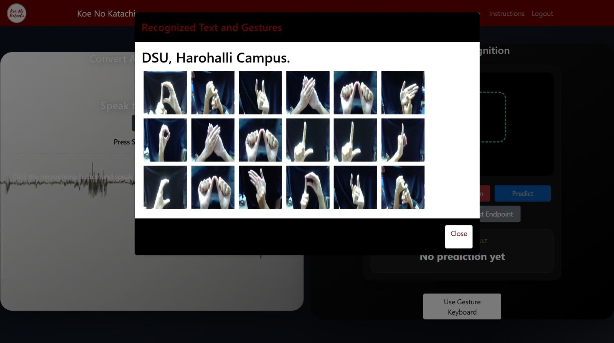
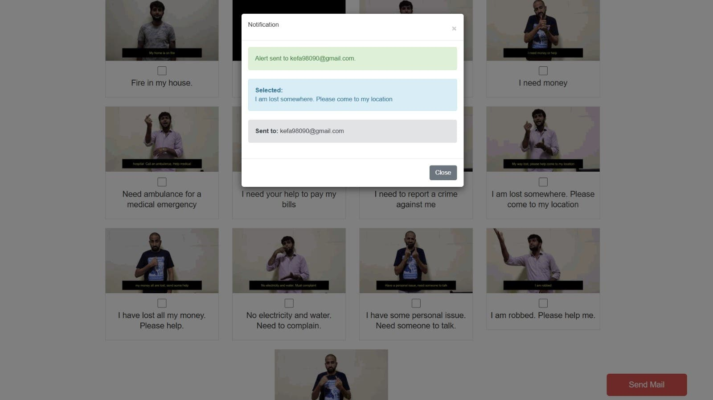

# Indian Sign Language Gesture Recognition

A deep learning and computer vision based Indian Sign Language (ISL) gesture recognition system developed using Python, TensorFlow, PyTorch, OpenCV, MediaPipe, and Django.

The project helps bridge communication between the deaf-mute community and the rest of society using real-time gesture recognition and audio-to-gesture conversion.

---

# Features

✅ Real-time hand gesture recognition using webcam  
✅ Indian Sign Language prediction system  
✅ Audio-to-gesture conversion  
✅ Gesture-to-audio conversion  
✅ Emergency communication support  
✅ Deep learning based gesture classification  
✅ Django web application interface  
✅ MediaPipe hand tracking integration  
✅ Real-time prediction display  
✅ Sign language keyboard support  

---

# Project Screenshots

## Login Page



---

## Home Page



---

## Audio To Gesture & Gesture Recognition



---

## Recognized Text and Gesture Output



---

## Audio Generation Output



---

## Emergency Communication Module



---

# Technologies Used

- Python
- TensorFlow
- PyTorch
- OpenCV
- MediaPipe
- Django
- NumPy
- Pandas
- Scikit-learn
- Albumentations

---

# Requirements

```txt
# Core ML & Deep Learning
torch==2.0.1
torchvision==0.15.2
tensorflow==2.15.0
keras==2.15.0

# Computer Vision & MediaPipe
opencv-python==4.8.0.74
mediapipe==0.10.5
pillow==10.0.0
scikit-image==0.21.0

# Data Processing
numpy==2.4.4
pandas==2.0.3
scikit-learn==1.3.0

# Image Augmentation & Processing
albumentations==1.3.0
imagehash==4.3.1

# Web Scraping
icrawler==0.11.2
bing-image-downloader==1.3.2

# Dataset Management
huggingface-hub==0.16.4
datasets==2.13.0

# Visualization
matplotlib==3.7.2
seaborn==0.12.2

# Utilities
tqdm==4.65.0
pyyaml==6.0
pydantic==2.0.2

# Web Framework
Django==2.2
django-crispy-forms==1.7.2

# Audio Processing
gtts==2.3.0

# Additional Utilities
python-dotenv==1.0.0
joblib==1.3.1
requests==2.31.0
```

---

# Project Structure

```text
Indian-Sign-Language-Gesture-Recognition/
│
├── templates/
├── static/
├── aud2gest/
├── gest2aud/
├── scripts/
├── user/
├── app.py
├── manage.py
├── requirements.txt
├── README.md
└── .gitignore
```

---

# How To Clone The Project

## Step 1 — Clone Repository

```bash
git clone https://github.com/KumudaKH/Indian-Sign-Language-Gesture-Recognition.git
```

---

## Step 2 — Open Project Folder

```bash
cd Indian-Sign-Language-Gesture-Recognition
```

---

# Create Virtual Environment

## Windows

```bash
python -m venv venv
```

---

# Activate Virtual Environment

```bash
venv\Scripts\activate
```

---

# Install Dependencies

```bash
pip install -r requirements.txt
```

---

# Run Django Server

```bash
python manage.py runserver
```

Open browser:

```text
http://127.0.0.1:8000/
```

---

# Real-Time Gesture Recognition

Run:

```bash
python predict_realtime.py
```

OR

```bash
python predict_webcam_gestures.py
```

---

# Train Model

```bash
python train_model.py
```

---

# Important Notes

Do NOT upload these folders to GitHub:

```text
venv/
.venv/
datasets/
dataset/
models/
media/
logs/
results/
```

---

# .gitignore

```txt
.claude/
venv/
.venv/
.venv-1/
__pycache__/
*.pyc

datasets/
dataset/
datasets_backup/

media/
logs/
results/

models/

*.h5
*.keras
*.pb
*.ckpt
*.csv
*.pkl
```

---

# Future Improvements

- Better gesture accuracy
- Mobile application integration
- Multi-language support
- Advanced NLP integration
- Cloud deployment
- Real-time sentence generation

---

# Author

KumudaKH

---

# License

This project is developed for educational and research purposes.
